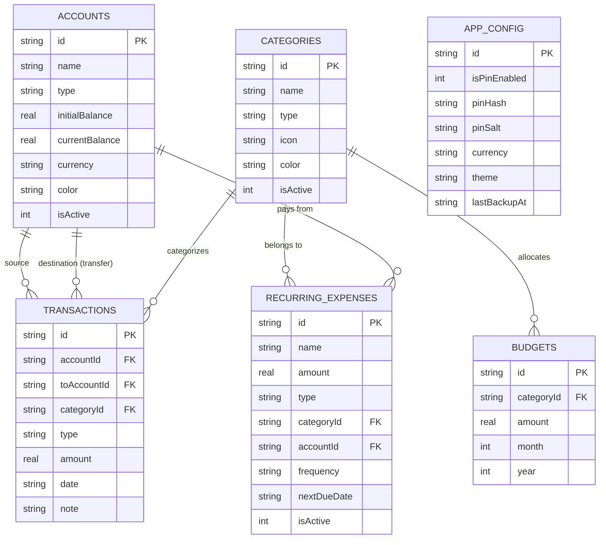

# 💰 AccountMobile (ระบบบันทึกรายรับ-รายจ่าย & บัญชีส่วนบุคคล)

[](https://expo.dev)
[](https://reactnative.dev)
[](https://react.dev)
[](https://www.typescriptlang.org)
[](https://docs.expo.dev/versions/latest/sdk/sqlite/)
[](LICENSE)

**AccountMobile** คือแอปพลิเคชันบันทึกรายรับ-รายจ่ายและบริหารจัดการการเงินส่วนบุคคลบนมือถือ พัฒนาด้วย **React Native** และ **Expo (SDK 57)** บนสถาปัตยกรรม **Local-First (Offline 100%)** ด้วยฐานข้อมูล **SQLite** ในเครื่อง ทำให้ทำงานได้รวดเร็ว ปลอดภัย และให้ความเป็นส่วนตัวสูงสุด ข้อมูลการเงินไม่ถูกส่งออกนอกอุปกรณ์

---

## ✨ จุดเด่นและฟีเจอร์หลัก (Key Features)

### 📊 1. ภาพรวมการเงิน (Dashboard)
- **สรุปยอดเงินสุทธิ (Net Balance)** จากทุกบัญชีแบบเรียลไทม์
- **สรุปกระแสเงินสดรายเดือน**: แสดงยอดรายรับ รายจ่าย และผลต่างสุทธิ (Net Cash Flow)
- **สัดส่วนค่าใช้จ่ายตามหมวดหมู่**: แสดงเปอร์เซ็นต์และยอดเงินพร้อมแถบสีแยกชัดเจน
- **ประวัติธุรกรรมล่าสุด**: ดูรายการเคลื่อนไหวทางการเงินล่าสุดได้อย่างรวดเร็ว

### 💳 2. จัดการหลายบัญชี (Multi-Account Management)
- รองรับประเภทบัญชีหลากหลาย:
  - 💵 **เงินสด (Cash)**
  - 🏦 **บัญชีธนาคาร (Bank)**
  - 📱 **กระเป๋าเงินอิเล็กทรอนิกส์ (E-Wallet)**
  - 💳 **บัตรเครดิต (Credit Card)**
  - 📈 **บัญชีการลงทุน (Investment)**
  - 📦 **อื่นๆ (Other)**
- ระบบ **โอนเงินระหว่างบัญชี (Account Transfer)** พร้อมคำนวณและอัปเดตยอดคงเหลืออัตโนมัติ

### 📝 3. บันทึกธุรกรรมครบวงจร (Transaction Tracker)
- บันทึก **รายรับ (Income)**, **รายจ่าย (Expense)** และ **การโอนเงิน (Transfer)**
- ระบุหมวดหมู่, บัญชี, วันที่และเวลา, พร้อมบันทึกข้อความช่วยจำ (Notes)
- ระบบค้นหาและตัวกรองธุรกรรมขั้นสูง (Filter ตามช่วงเวลา, หมวดหมู่, บัญชี, หรือประเภทรายการ)
- จัดเรียงลำดับรายการตามวันที่หรือจำนวนเงิน

### 🎯 4. วางแผนงบประมาณ (Budget Planning)
- ตั้งงบประมาณรายเดือนแยกตามหมวดหมู่ (เช่น อาหาร, การเดินทาง, บันเทิง)
- แถบแสดงความคืบหน้า (Progress Bar) และการคำนวณยอดเงินคงเหลือแบบอัตโนมัติ
- ระบบแจ้งเตือนสถานะเมื่องบประมาณเริ่มใกล้เต็มหรือใช้งานเกินงบที่ตั้งไว้

### 🔄 5. ค่าใช้จ่ายประจำ (Recurring & Subscriptions)
- จัดการบิลและค่าใช้จ่ายที่เกิดขึ้นประจำ เช่น ค่าเช่าบ้าน, ค่าบริการสตรีมมิ่ง (Netflix, Spotify), ค่าน้ำ, ค่าไฟ
- รองรับรอบความถี่: รายวัน (Daily), รายสัปดาห์ (Weekly), รายเดือน (Monthly) และรายปี (Yearly)
- ระบบบันทึกอัตโนมัติเมื่อถึงกำหนดรอบบิล

### 📈 6. รายงานและสถิติ (Reports & Analytics)
- กราฟสรุปผลเปรียบเทียบรายรับ-รายจ่าย รายเดือนและรายปี
- วิเคราะห์พฤติกรรมการใช้จ่ายเพื่อการวางแผนการเงินในอนาคต

### 🏷️ 7. หมวดหมู่ที่ปรับแต่งได้ (Custom Categories)
- เพิ่ม แก้ไข และเปิด/ปิดการใช้งานหมวดหมู่รายรับและรายจ่าย
- กำหนดไอคอนและโทนสีประจำหมวดหมู่เพื่อการแยกแยะที่ง่ายขึ้น

### 🔒 8. ความปลอดภัย & ความเป็นส่วนตัว (PIN Lock & Security)
- ระบบล็อคแอปพลิเคชันด้วยรหัสผ่าน **PIN (4 หลัก)**
- ป้องกันการเข้าถึงข้อมูลโดยไม่ได้รับอนุญาตผ่าน `PinGatekeeper`
- เข้ารหัสความปลอดภัยของ PIN ด้วย Salt และ Hash ผ่าน `expo-crypto`

### 💾 9. สำรองและกู้คืนข้อมูล (Backup & Restore)
- ส่งออกข้อมูลทั้งหมดเป็นไฟล์ **JSON Backup**
- กู้คืนข้อมูล (Restore) กลับเข้าสู่ระบบได้ทุกเมื่อ
- ระบบรีเซ็ตข้อมูลเริ่มต้น (Factory Reset / Seeding Data)

---

## 🛠️ สถาปัตยกรรมและเทคโนโลยีที่ใช้ (Tech Stack)

| ส่วนประกอบ | เทคโนโลยี / ไลบรารี | รายละเอียด |
| :--- | :--- | :--- |
| **Framework** | [Expo SDK 57](https://expo.dev) | แพลตฟอร์มหลักสำหรับการพัฒนา React Native |
| **Core** | [React 19](https://react.dev) & [React Native 0.86](https://reactnative.dev) | แกนหลักของแอปพลิเคชัน รองรับ React Compiler |
| **Routing** | [Expo Router v57](https://docs.expo.dev/router/introduction) | File-based Routing จัดโครงสร้างหน้าจอผ่านโฟลเดอร์ |
| **Language** | [TypeScript 6](https://www.typescriptlang.org) | Type-safe ตลอดทั้งโปรเจกต์ |
| **Database** | [expo-sqlite](https://docs.expo.dev/versions/latest/sdk/sqlite/) | ฐานข้อมูล SQLite ในเครื่อง (WAL Mode) |
| **Security** | [expo-crypto](https://docs.expo.dev/versions/latest/sdk/crypto/) | สำหรับสร้างรหัสและ Hash PIN Code |
| **Animation** | [React Native Reanimated](https://docs.swmansion.com/react-native-reanimated/) | แอนิเมชันลื่นไหลระดับ Native Thread |
| **UI & Icons** | `@expo/vector-icons` (Ionicons) | ชุดไอคอนมาตรฐานสำหรับโมบายล์ |

---

## 📂 โครงสร้างโปรเจกต์ (Project Structure)

```text
accountMobile/
├── assets/                    # รูปภาพ ไอคอน และทรัพยากรของแอปพลิเคชัน
├── src/
│   ├── app/                   # ระบบ Routing ของแอปพลิเคชัน (Expo Router)
│   │   ├── (tabs)/            # หน้าจอหลักแบบ Tab Bar
│   │   │   ├── _layout.tsx    # การกำหนดแถบแท็บด้านล่าง
│   │   │   ├── index.tsx      # แท็บ 1: ภาพรวมการเงิน (Dashboard)
│   │   │   ├── transactions.tsx# แท็บ 2: ประวัติธุรกรรม
│   │   │   ├── accounts.tsx   # แท็บ 3: จัดการบัญชี
│   │   │   ├── budgets.tsx    # แท็บ 4: งบประมาณ & บิลประจำ
│   │   │   └── more.tsx       # แท็บ 5: เมนูเพิ่มเติม & ตั้งค่า
│   │   ├── _layout.tsx        # Root Layout ครอบด้วย PinGatekeeper
│   │   ├── backup.tsx         # หน้าสำรองและกู้คืนข้อมูล
│   │   ├── categories.tsx     # หน้าจัดการหมวดหมู่
│   │   ├── pin-settings.tsx   # หน้าตั้งค่ารหัส PIN
│   │   ├── recurring.tsx      # หน้าจัดการค่าใช้จ่ายประจำ
│   │   └── reports.tsx        # หน้ารายงานและสถิติ
│   ├── components/            # UI Components ที่ใช้งานซ้ำ
│   │   ├── auth/              # PinGatekeeper ตรวจสอบรหัส PIN ก่อนเข้าแอป
│   │   ├── modals/            # โมดอลเพิ่ม/แก้ไข (Account, Budget, Category, Transaction ฯลฯ)
│   │   └── ui/                # UI Elements พื้นฐาน (Icons, Collapsible ฯลฯ)
│   ├── constants/             # ค่าคงที่และ Themes (สี, สไตล์)
│   ├── data/                  # ข้อมูลเริ่มต้น (Initial Data Seeding)
│   ├── hooks/                 # Custom React Hooks
│   ├── lib/                   # การเชื่อมต่อ SQLite และ Data Access Logic
│   │   └── database.ts        # ฟังก์ชัน Query, CRUD, Migration, และ Aggregation
│   ├── types/                 # TypeScript Interfaces และ Type Definitions
│   └── utils/                 # ฟังก์ชัน Utility (Currency, Date, Security)
├── app.json                   # การกำหนดค่า Expo Application
├── package.json               # รายการ Dependencies และ Scripts
└── tsconfig.json              # การตั้งค่า TypeScript
```

---

## 🚀 เริ่มต้นใช้งาน (Getting Started)

### ข้อกำหนดเบื้องต้น (Prerequisites)
- [Node.js](https://nodejs.org/) (เวอร์ชัน 18 ขึ้นไป แนะนำเวอร์ชัน LTS)
- [Git](https://git-scm.com/)
- สมาร์ทโฟนที่ติดตั้งแอปพลิเคชัน **Expo Go** (ดาวน์โหลดได้จาก App Store / Google Play) หรือติดตั้ง **Android Studio / Xcode Emulator** บนเครื่องคอมพิวเตอร์

### 1. โคลนโปรเจกต์และติดตั้ง Dependencies

```bash
git clone https://github.com/your-username/accountMobile.git
cd accountMobile
npm install
```

### 2. รันแอปพลิเคชันในโหมด Development

```bash
npx expo start
```

เมื่อเซิร์ฟเวอร์เริ่มทำงาน คุณสามารถเลือกเปิดแอปได้ตามต้องการ:
- **สมาร์ทโฟนจริง**: สแกน QR Code บนหน้าจอ Terminal ผ่านแอป **Expo Go** (Android) หรือผ่านแอป Camera (iOS)
- **Android Emulator**: กดปุ่ม `a` ใน Terminal หรือใช้คำสั่ง `npm run android`
- **iOS Simulator**: กดปุ่ม `i` ใน Terminal หรือใช้คำสั่ง `npm run ios`
- **เว็บเบราว์เซอร์**: กดปุ่ม `w` ใน Terminal หรือใช้คำสั่ง `npm run web`

---

## 📜 คำสั่ง Scripts ทั้งหมด (Available Scripts)

| คำสั่ง | คำอธิบาย |
| :--- | :--- |
| `npm run start` | เริ่ม Expo Development Server |
| `npm run android` | เปิดโปรเจกต์บน Android Emulator |
| `npm run ios` | เปิดโปรเจกต์บน iOS Simulator |
| `npm run web` | เปิดโปรเจกต์บนเว็บเบราว์เซอร์ |
| `npm run lint` | ตรวจสอบ Code Style และ Quality ด้วย ESLint |
| `npx tsc --noEmit` | ตรวจสอบ Type Checking ของ TypeScript ทั่วทั้งโปรเจกต์ |
| `npx expo-doctor` | ตรวจสอบความถูกต้องของแพ็กเกจและการตั้งค่าภายใน Expo |

---

## 🗄️ โครงสร้างฐานข้อมูล (Database Schema)

แอปพลิเคชันใช้ฐานข้อมูล SQLite ในเครื่อง จัดเก็บตารางหลักดังนี้:



---

## 🛡️ ความปลอดภัยและความเป็นส่วนตัว (Privacy & Security)

1. **Local Storage 100%**: ข้อมูลการเงินทั้งหมด (ทั้งรายการธุรกรรม ยอดเงิน และบัญชี) ถูกจัดเก็บไว้ในเครื่องของคุณเองผ่าน SQLite ไม่มีการส่งข้อมูลขึ้น Cloud Server
2. **Offline-first Architecture**: ไม่จำเป็นต้องเชื่อมต่ออินเทอร์เน็ต สามารถใช้งานและบันทึกข้อมูลได้ทุกที่ทุกเวลา
3. **PIN Protection**: ป้องกันการเข้าถึงจากบุคคลอื่นด้วยระบบ PinGatekeeper ซึ่งเก็บรหัสผ่านในรูปแบบ Salting & Hashing ที่ปลอดภัย

---

## 📄 สัญญาอนุญาต (License)

โปรเจกต์นี้เผยแพร่ภายใต้สัญญาอนุญาต [MIT License](LICENSE) สามารถนำไปใช้งาน ปรับปรุง และพัฒนาต่อยอดได้อย่างอิสระ
